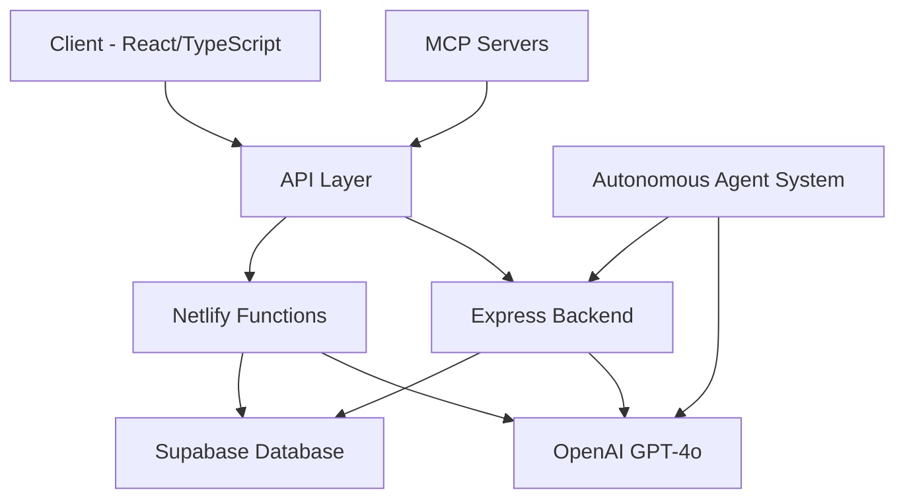
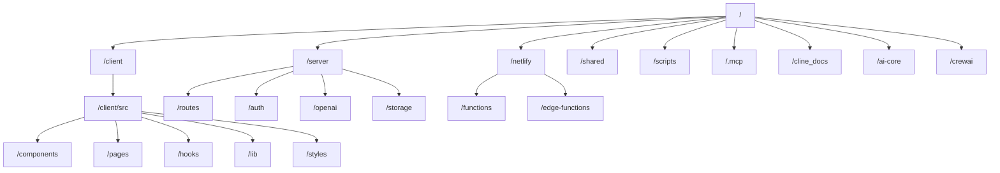

# Mystic Oracle V2 - Comprehensive Project Overview

## 1. Project Overview

Mystic Oracle V2 (also referred to as Mystic Arcana in some documentation) is a spiritual guidance platform that leverages AI to provide personalized metaphysical insights through:

- Tarot card readings (with both authenticated and public endpoints)
- Astrology charts and birth chart calculations
- Zodiac spreads with premium/non-premium variations
- Daily horoscopes
- Spiritual guidance and interpretations

The application blends modern web technologies with mystical aesthetics to create an engaging user experience, with differentiation between free users and premium subscribers.

## 2. Architecture & Technical Stack



### Frontend

- **Framework**: React with TypeScript
- **Styling**: Tailwind CSS with custom components
- **UI Components**: Radix UI primitives
- **Animations**: Framer Motion
- **Routing**: Wouter
- **Form Handling**: React Hook Form with Zod validation
- **Build Tool**: Vite

### Backend

- **Server**: Node.js with Express (being migrated to Netlify Functions)
- **Authentication**: Supabase Auth
- **Database**: Supabase (PostgreSQL)
- **AI Integration**: OpenAI API (GPT-4o)
- **Astrology Calculations**: Sweph library

### DevOps

- **Deployment**: Netlify
- **CI/CD**: Netlify pipelines (in progress)
- **Environment**: Docker for local development of MCP servers

### Agent System

- The project includes an autonomous agent system built with CrewAI
- Multiple specialized agents handle different tasks
- MCP (Model Context Protocol) servers provide extended functionality

## 3. Project Structure



Key directories:

- `/client`: Frontend React application
- `/server`: Backend Express application (being migrated to Netlify Functions)
- `/netlify`: Netlify Functions and Edge Functions
- `/shared`: Shared code between frontend and backend
- `/scripts`: Utility scripts for automation, setup, and management
- `/ai-core`: Core AI functionality and services
- `/crewai`: CrewAI autonomous agent configuration
- `/cline_docs`: Project documentation

## 4. Key Features Implemented

### Tarot Reading System

- Random tarot card selection
- Daily tarot card feature (currently has an issue)
- Personalized readings with AI interpretation
- Public and authenticated endpoints
- Reading history tracking
- Save/unsave functionality

### Astrology Features

- Birth chart calculations (needs improvement)
- Zodiac spread generation with premium/free variations
- Daily horoscope generation (scheduled at 00:05 daily)
- Interactive astrology wheel (in progress)

### AI Integration

- OpenAI GPT-4o for generating interpretations
- Personalized content based on user history
- Premium content generation for subscribers

### User Systems

- Authentication with Supabase
- Premium vs free user differentiation
- User reading history tracking
- Premium content paywall

### Data Services

- NASA data fetching (scheduled at 00:15 daily)
- Special event notifications (e.g., Lunar Eclipse, St. Patrick's Day)
- Supabase storage for readings and horoscopes

## 5. Current Status and Issues

### Working Features

- Basic tarot reading functionality
- Authentication system
- Zodiac spread generation
- OpenAI GPT-4o integration
- User reading history tracking
- Premium content storage

### Critical Issues

- **Daily Tarot Card Display Issue**: The daily tarot deck doesn't connect to the Rider-Waite deck as intended. Currently shows as a white page with a broken image and only a refresh button visible.
- Birth chart calculations need fixing
- Authentication issues preventing access to birth chart
- Premium feature access needs testing

### Recently Addressed

- Dependency issues have been fixed
- Build process improvements

## 6. Development Workflow

### Setting Up the Development Environment

1. Clone the repository
2. Install dependencies: `npm install`
3. Set up `.env` file with Supabase and other API credentials
4. Start the development server: `npm run dev`

### MCP Server Setup for Development

- Docker is used for local development of MCP servers
- Includes vector database, embedding service, text generation service
- Development proxy serves the application at <http://localhost:7777>

### Key Environment Variables

- Supabase URL and anon key
- Hugging Face API tokens (for embedding and text generation)
- OpenAI API key

### Build Process

```bash
npm run build
```

This command:

1. Builds the React frontend with Vite
2. Bundles the server code with esbuild

### Testing

- Jest for unit testing: `npm test`
- Vitest for component testing

### Deployment

```bash
npm run deploy
```

Deploys the application to Netlify

## 7. Autonomous Agent System

The project includes a sophisticated autonomous agent system that can perform tasks automatically:

### Agent Management

- Start agents: `npm run agents:start`
- Check status: `npm run agents:status`
- Enable away mode: `npm run agents:away:enable`
- Disable away mode: `npm run agents:away:disable`

### Agent Types

- SME (Subject Matter Expert) Agent: `npm run agent:sme`
- Web Crawler Agent: `npm run agent:web-crawler`
- Task Executor Agent

### MCP Servers

The project uses Model Context Protocol (MCP) servers for various functionalities:

- React UI and Design System
- Fullstack and Netlify EdgeDocs
- AI Function Pack for tarot/astrology
- CMS and E-commerce integration

## 8. Immediate Tasks for New Developer

1. **Fix Daily Tarot Card Display Issue** (HIGHEST PRIORITY): Fix the connection between the daily tarot deck and the Rider-Waite deck. Address the white page/broken image issue.
2. Fix birth chart calculations to properly display interpretations
3. Add tarot card animations during selection and reading
4. Implement the zodiac spread as a premium feature
5. Configure Netlify deployment pipeline
6. Set up environment variables in Netlify dashboard
7. Convert Express routes to Netlify Functions
8. Ensure all premium features are accessible during testing
9. Fix authentication issues preventing access to birth chart
10. Address TypeScript errors in astronomy.ts and related files

## 9. Medium to Long-term Roadmap

### Medium-term Goals

1. Develop advanced birth chart incorporating recently discovered celestial bodies
2. Create feedback mechanism to improve reading accuracy
3. Design personalization system for tailored readings
4. Enhance interactive astrology wheel visualization

### Long-term Vision

1. Build a comprehensive personalization engine based on user feedback
2. Develop an advanced celestial database for unique chart interpretations
3. Create a learning system to continuously improve reading accuracy
4. Implement cross-feature insights (tarot + astrology combined readings)
5. Develop mobile app version with offline capabilities

## 10. Key API Endpoints

### Tarot Reading Endpoints

- `GET /api/tarot-data`: Get information about available tarot data
- `GET /api/tarot-cards/random`: Get random tarot cards
- `GET /api/tarot-cards/card-of-the-day`: Get the card of the day
- `POST /api/public/tarot-readings`: Generate a public tarot reading
- `GET /api/tarot-readings`: Get user's tarot readings (authenticated)
- `POST /api/tarot-readings`: Generate a new tarot reading (authenticated)
- `POST /api/tarot-readings/zodiac-spread`: Generate a zodiac spread (authenticated)

### Astrology Endpoints

- `POST /api/public/birth-chart`: Generate a birth chart (public)
- `POST /api/public/zodiac-spread`: Generate a zodiac spread preview (public)
- `GET /api/astrology-charts`: Get user's astrology charts (authenticated)
- `POST /api/astrology-charts/birth-chart`: Create a new birth chart (authenticated)

### Horoscope Endpoints

- `GET /api/horoscopes/preview/:sign`: Get a preview of today's horoscope
- `GET /api/horoscopes/:sign`: Get today's horoscope for a sign

### Subscription Endpoints

- `GET /api/subscription/plans`: Get subscription plans
- `POST /api/subscription/checkout`: Create checkout session (authenticated)
- `GET /api/subscription/status`: Get current subscription status (authenticated)

## 11. What's Next?

To get started with the project, I recommend:

1. First, set up the development environment following the instructions in SETUP.md
2. Run the application locally and explore its current functionality
3. Investigate and fix the daily tarot card display issue as the highest priority
4. Review the codebase structure focusing on the components, pages, and API routes
5. Understand the authentication and premium feature implementation
6. Get familiar with the agent system by running some of the agent commands
7. Set up the Netlify deployment pipeline for testing your changes
